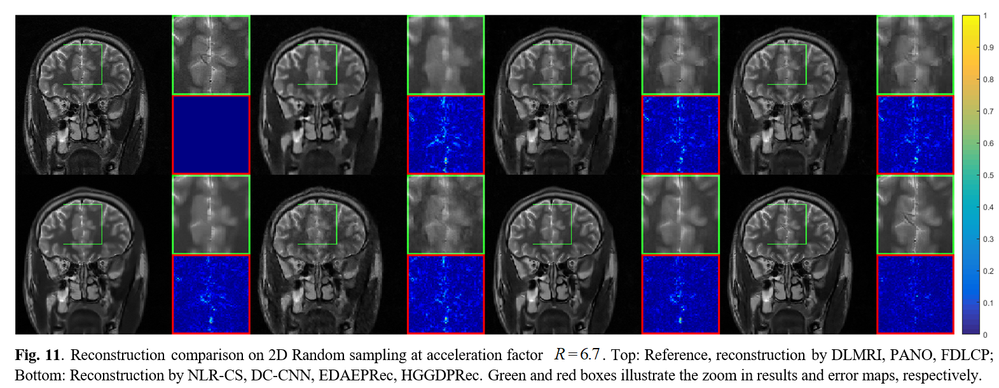

# HGGDP

**Paper**: HGGDP: Homotopic Gradients of Generative Density Priors for MR Image Reconstruction

**Authors**: Cong Quan, Jinjie Zhou, Yuanzheng Zhu, Yu Guan, Dong Liang, Yuhao Wang, Qiegen Liu 

Date : 11/2018  
Version : 1.0  
The code and the algorithm are for non-comercial use only.  
Copyright 2018, Department of Electronic Information Engineering, Nanchang University.  
Paul C. Lauterbur Research Center for Biomedical Imaging, Shenzhen Institutes of Advanced Technology, Chinese Academy of Sciences, Shenzhen 518055, China    
Medical AI research center, Shenzhen Institutes of Advanced Technology, Chinese Academy of Sciences, Shenzhen 518055, China 

 

 

Performance exhibition of “multi-view noise” strategy. (a) Training sliced score matching (SSM) loss and validation loss for each iteration. (b) Image quality comparison on the brain dataset at 15% radial sampling: Reconstruction images, error maps (Red) and zoom-in results (Green).

 

Pipeline of sampling from the high-dimensional noisy data distribution with multi-view noise and intermediate samples. (a) Conceptual dia-gram of the sampling on high-dimensional noisy data distribution with multi-view noise. (b) Intermediate samples of annealed Langevin dynamics.

## Reconstruction Results by Various Methods at 85% 2D Random Undersampling.
  

Reconstruction comparison on pseudo radial sampling at acceleration factor 6.7 . Top: Reference, reconstruction by DLMRI, PANO, FDLCP; Bottom: Reconstruction by NLR-CS, DC-CNN, EDAEPRec, HGGDPRec. Green and red boxes illustrate the zoom in results and error maps, respectively.

## Test Data
In file './test_data_31', 31 complex-valued MRI data with size of 256x256 were acquired by using a 3D fast-spin-echo (FSE) sequence with T2 weighting from a 3.0T whole body MR system (SIEMENS MAGNETOM TrioTim).

## Other Related Projects
  * Multi-Channel and Multi-Model-Based Autoencoding Prior for Grayscale Image Restoration  
[**[Paper]**](https://ieeexplore.ieee.org/stamp/stamp.jsp?tp=&arnumber=8782831)  [**[Code]**](https://github.com/yqx7150/MEDAEP)   [**[Slide]**](https://github.com/yqx7150/EDAEPRec/tree/master/Slide)

  * Highly Undersampled Magnetic Resonance Imaging Reconstruction using Autoencoding Priors  
[**[Paper]**](https://cardiacmr.hms.harvard.edu/files/cardiacmr/files/liu2019.pdf)  [**[Code]**](https://github.com/yqx7150/EDAEPRec)   [**[Slide]**](https://github.com/yqx7150/EDAEPRec/tree/master/Slide)

  * High-dimensional Embedding Network Derived Prior for Compressive Sensing MRI Reconstruction  
 [**[Paper]**](https://www.sciencedirect.com/science/article/abs/pii/S1361841520300815?via%3Dihub)   [**[Code]**](https://github.com/yqx7150/EDMSPRec)
 
  * Denoising Auto-encoding Priors in Undecimated Wavelet Domain for MR Image Reconstruction  
[**[Paper]**](https://arxiv.org/ftp/arxiv/papers/1909/1909.01108.pdf)  [**[Code]**](https://github.com/yqx7150/WDAEPRec)

  * Complex-valued MRI data from SIAT--test31 [**[Data]**](https://github.com/yqx7150/EDAEPRec/tree/master/test_data_31)

  * Complex-valued MRI data from SIAT--SIAT_MRIdata200 [**[Data]**](https://github.com/yqx7150/SIAT_MRIdata200)
 
  * Learning Multi-Denoising Autoencoding Priors for Image Super-Resolution  
[**[Paper]**](https://www.sciencedirect.com/science/article/pii/S1047320318302700)   [**[Code]**](https://github.com/yqx7150/MDAEP-SR)

  * REDAEP: Robust and Enhanced Denoising Autoencoding Prior for Sparse-View CT Reconstruction  
[**[Paper]**](https://ieeexplore.ieee.org/document/9076295)   [**[Code]**](https://github.com/yqx7150/REDAEP)
